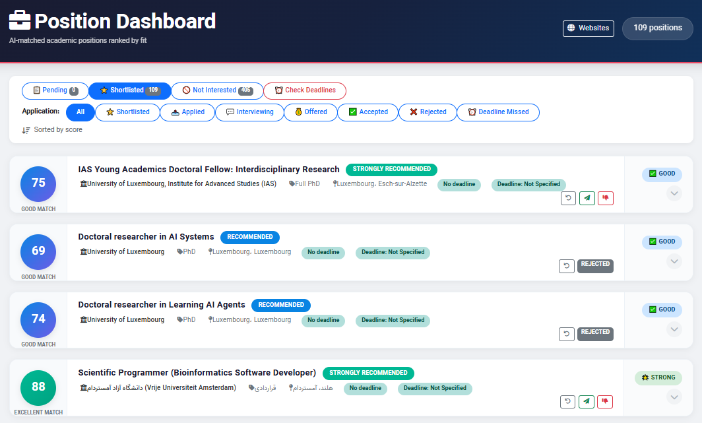
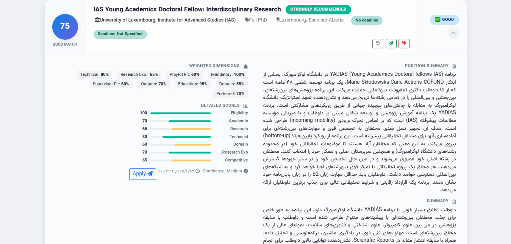

Here's the updated README with the field-of-study note added to the Fixtures section:

---

# 🔬 ApplyTools – Smart Academic Position Matcher

**ApplyTools** is a Django-based application that scrapes academic and research positions from various sources, matches them against your CV using AI, and helps you manage your job applications. It leverages DeepSeek's free chat API (via the [Deepseek-API](https://github.com/sums001/Deepseek-API) library) for intelligent CV–job matching.

---

## 🚀 Features

- **Multi‑source scraping** – Supports both HTML and JSON API sources with flexible selectors and authentication.
- **AI‑powered matching** – Extracts position details and matches them against your CV using DeepSeek's models.
- **Application workflow** – Track positions from PENDING → SHORTLISTED → APPLIED → INTERVIEWING → OFFERED/REJECTED.
- **Real‑time progress** – Server‑sent events (SSE) for scraping and matching progress.
- **Full‑text CV matching** – Paste your CV and get detailed match scores, category, and recommendations.
- **REST API** – All operations available via a clean REST API with pagination.
- **Admin‑friendly** – Web UI to add/edit websites and manage positions.
- **Initial data fixtures** – Pre‑configured websites and AI prompts for a quick start.

---

## 📸 Screenshots


*Main dashboard showing websites, scraping progress, and match status.*


*Detailed view of a matched position with AI-generated scores and recommendations.*

More screenshots will be added as the project evolves.

---

## 🙏 Acknowledgments

This project would not be possible without the excellent work of **sums001** and contributors on:

**[Deepseek-API](https://github.com/sums001/Deepseek-API)** – A free LLM API powered by DeepSeek that turns the free chat at chat.deepseek.com into an OpenAI‑compatible API. No API key, no credits, no paid plan.

We are deeply grateful for this open‑source contribution that makes AI‑powered matching accessible to everyone.

---

## 📋 Requirements

- Python **3.9+**
- Git
- Playwright (for browser automation)
- A DeepSeek account (free tier works perfectly)
- A modern browser (for the admin UI)

---

## 🛠️ Installation

Follow these steps to set up ApplyTools on your local machine.

### 1. Clone the repository

```bash
git clone https://github.com/alaeimo/applytools.git
cd applytools
```

### 2. Create a virtual environment

**macOS / Linux:**
```bash
python3 -m venv venv
source venv/bin/activate
```

**Windows (PowerShell):**
```bash
python -m venv venv
venv\Scripts\Activate.ps1
```

**Windows (cmd):**
```bash
python -m venv venv
venv\Scripts\activate.bat
```

### 3. Copy environment configuration

The project includes a template for environment variables. Copy it to `.env` and adjust if needed.

```bash
cp .env-template .env
```

### 4. Install dependencies

```bash
pip install -r requirements.txt
```

### 5. Install Playwright and Chromium

Playwright is used for headless browser automation during scraping and authentication.

```bash
playwright install chromium
```

### 6. Authenticate with DeepSeek

Run the authentication script to sign in once. A browser will open – log into your DeepSeek account and solve the human‑check. Your session will be cached for future use.

```bash
python -m apps.ai.deepseek.auth
```

This step is essential for the AI matching to work.

### 7. Run database migrations

```bash
python manage.py migrate
```

### 8. Load initial fixtures (optional but recommended)

> **🔍 Field of Study Note**  
> The provided website fixtures are pre‑configured for **Computer Science** positions (e.g., PhD, postdoc, and faculty positions in CS, AI, and related fields). If you are in a different field, you have two options:
> 1. **Before loading**: Edit `fixtures/websites.json` manually to adjust search URLs, API endpoints, and filters to match your discipline.
> 2. **After loading**: Use the web UI to modify the website settings (e.g., change the `pagination_url_pattern` to include your field's keywords).
>
> The fixtures are meant as a starting point – customize them to fit your research area!

This imports a starter set of website configurations and AI prompt templates, so you can start scraping and matching immediately.

```bash
python manage.py loaddata fixtures/websites.json
python manage.py loaddata fixtures/prompts.json
```

### 9. Create a superuser (for admin access)

```bash
python manage.py createsuperuser
```

### 10. Start the development server

```bash
python manage.py runserver
```

Visit http://127.0.0.1:8000 to start using ApplyTools.

> **Note**: The default admin interface is available at `/admin` if you have `ENABLE_DJANGO_ADMIN_PANEL=True` in your `.env`.

---

## 🧠 How It Works

### 1. Manage Websites
- Add websites via the **Web UI** (green "+" button) or the REST API.
- Configure **HTML selectors** (for HTML scraping) or **API endpoints** with JSON key paths (for API scraping).
- Set authentication tokens and pagination parameters.
- Choose whether to fetch position details via HTML or from the API response using the **Detail Source** selector.

### 2. Scrape Positions
- Click **"Scrape"** on a website card.
- Real‑time progress is streamed via Server‑Sent Events (SSE).
- New positions are saved to the database and can be matched later.

### 3. Match Positions Against Your CV
- Click **"Match"** on a website card.
- Paste your CV text and choose the language.
- The system:
  1. Extracts the position summary and requirements.
  2. Analyzes your CV.
  3. Calculates detailed match scores across multiple dimensions (eligibility, academic fit, research fit, etc.).
  4. Provides a final verdict and recommendation (Strongly Recommended, Recommended, Possible but Risky, Not Recommended).
- Results are saved with the position for future reference.

### 4. Application Workflow
- **Pending Review** – Newly scraped or matched positions.
- **Shortlisted** – Positions you want to apply to.
- **Applied** – Applications submitted.
- **Interviewing / Offered / Accepted / Rejected** – Full tracking.

---

## 🔌 REST API Endpoints

| Endpoint | Method | Description |
|----------|--------|-------------|
| `/api/v1/websites/` | GET/POST | List or create websites |
| `/api/v1/websites/{id}/` | GET/PUT/DELETE | Manage a single website |
| `/api/v1/positions/` | GET | List positions (paginated) |
| `/api/v1/positions/dashboard/` | GET | Dashboard with filtering |
| `/api/v1/scrape/{website_id}/stream/` | GET | Scrape positions (SSE) |
| `/api/v1/match/stream/` | POST | Match CV against positions (SSE) |
| `/api/v1/admin/` | – | Django admin interface (if enabled) |

All API endpoints are versioned and respond with JSON.

---

## 📂 Project Structure

```
applytools/
├── apps/
│   ├── ai/                 # AI matching logic + DeepSeek integration
│   ├── websites/           # Website models and scraping services
│   ├── positions/          # Position models and serializers
│   └── core/               # Shared utilities
├── fixtures/               # Initial data (websites, prompts)
├── .env-template           # Environment variables template
├── manage.py
├── requirements.txt
└── README.md
```

---

## 🧪 Testing the Scraper (without saving)

You can test a website configuration without saving positions using the Django shell:

```python
from apps.websites.models import Website
from apps.websites.services import PositionScraper
import asyncio

website = Website.objects.get(id=1)
scraper = PositionScraper(website)

async def test():
    async for pos in scraper.scrape(max_pages=2):
        print(f"{pos['title']} – {pos['url']}")

asyncio.run(test())
```

This prints scraped positions without persisting them.

---

## 🔐 Environment Variables (.env)

The `.env` file controls runtime behavior. Below are the available variables with their defaults:

| Variable | Default | Description |
|----------|---------|-------------|
| `SECRET_KEY` | (auto‑generated) | Django secret key. |
| `ALLOWED_HOSTS` | `*` | Comma‑separated list of allowed hosts. |
| `CSRF_TRUSTED_ORIGINS` | `http://localhost:3030` | Origins for CSRF trust. |
| `DEBUG` | `True` | Enable debug mode. Set to `False` in production. |
| `ENABLE_DJANGO_ADMIN_PANEL` | `True` | Show/hide the Django admin interface. |
| `ENABLE_HTTPS` | `False` | Force HTTPS redirects (requires proper SSL setup). |
| `MEDIA_HOST` | `http://127.0.0.1:8000` | Base URL for media files. |
| `API_VERSION` | `v1` | API version prefix. |
| `TIMEZONE` | `UTC` | Server timezone. |

**Example `.env`** (provided in `.env-template`):
```bash
SECRET_KEY="django-insecure-^ko#8&3jd+u@fdh9-qb*36+xl11p3ms45ryrgg34t5yy4557i&%"
ALLOWED_HOSTS=*
CSRF_TRUSTED_ORIGINS=http://localhost:3030
DEBUG=True
ENABLE_DJANGO_ADMIN_PANEL=True
ENABLE_HTTPS=False
MEDIA_HOST=http://127.0.0.1:8000
API_VERSION='v1'
TIMEZONE=UTC
```

---

## 📦 Fixtures

Two fixture files are provided for a quick start:

- **`fixtures/websites.json`** – Pre‑configured websites (e.g., Academic Positions, DAAD, etc.) with working selectors/API endpoints.
- **`fixtures/prompts.json`** – AI prompt templates for matching.

> **🔍 Important Note**  
> The websites in `fixtures/websites.json` are configured specifically for **Computer Science** research positions. The search URLs, API endpoints, and filters are tailored to CS-related keywords (e.g., "computer-science", "AI", "PhD").  
> 
> If your research area is different, you should:
> - **Option A (Recommended)**: Load the fixtures, then use the web UI to edit each website's settings (e.g., change `pagination_url_pattern` from `/jobs/position/phd/field/computer-science` to `/jobs/position/phd/field/your-field`).
> - **Option B**: Edit `fixtures/websites.json` directly (it's a JSON file) before loading it, adjusting the fields to match your discipline.

To load them after migration:

```bash
python manage.py loaddata fixtures/websites.json
python manage.py loaddata fixtures/prompts.json
```

---

## 🤝 Contributing

Contributions are welcome! Please open an issue or submit a pull request.

### Development Workflow

1. Fork the repository.
2. Create a feature branch (`git checkout -b feature/amazing-feature`).
3. Commit your changes (`git commit -m 'Add some amazing feature'`).
4. Push to the branch (`git push origin feature/amazing-feature`).
5. Open a Pull Request.

We actively encourage improvements to scraping support, matching accuracy, and UI.

---

## 📄 License

**MIT License** – Free to use, modify, and distribute.  
**Not for commercial resale or use as the foundation of a proprietary SAAS product without express permission.**

Copyright (c) 2026 **Mohammad Alaei** – [alaeimo.ir](https://alaeimo.ir)

---

## 👨‍💻 Contributors

- **Mohammad Alaei** – [alaeimo.ir](https://alaeimo.ir)

---

## 🙌 Special Thanks

- **[Deepseek-API](https://github.com/sums001/Deepseek-API)** – For providing a free, open‑source bridge to DeepSeek's chat models.
- **DeepSeek** – For their powerful AI models made available to everyone.

---

## ⚠️ Disclaimer

This is an unofficial project. It is not affiliated with or endorsed by DeepSeek. Use responsibly and in accordance with DeepSeek's terms of service.

---

**Built with ❤️ for researchers and academics everywhere.**